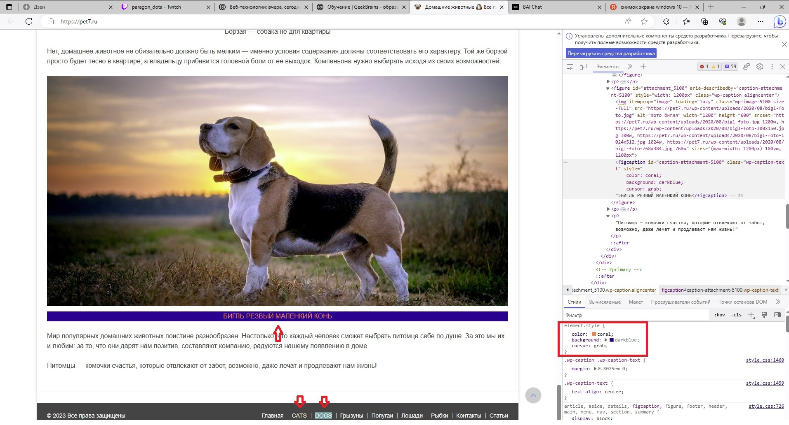

### ДЗ 1
Задача: на основе сайта https://pet7.ru/
- Определите, на каком протоколе работает сайт.
- Проанализируйте структуру страницы сайта.
- Внесите не менее 3 изменений на страницу с помощью инструмента разработчика и представьте скриншоты было/стало.
- Создайте прототип низкой детализации.

*определенна структура сайта, найдены HEADER, FOOTER, зону контента*

*добавленны изменения:*

1. под фото надпись другая другим цветом и фоном, при наведения на этой блок меняется курсор
2. внизу 2 стрелки: замена надписи в одной надписи замена цвета букв, в другой фон

*прототип низкой детализации*